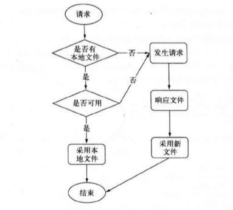

## 缓存
在Web中，有时候我们需要缓存一些不变的静态资源，可以节省宽带。
一般为了提升性能，我们采用了几条关于缓存的规则
- 配置Expires或Cache-Control到报头中
- 配置ETags

为了展开将这几条规则，我们以如何让浏览器缓存我们的静态资源，这也是一个需要由服务器和浏览器共同协完成的事情
通常来讲 Post delete put这类带行为性的请求操作一般不做任何缓存，**大多数的缓存都应用在Get请求**。请求缓存的流程如下

### 协商缓存

简单讲，本地没有文件，浏览器就会直接去服务器请求数据，并将其缓存放在某个缓存目录下。在第二次请求时，它将本地文件进行检查，如果不能确认本地文件是否可以直接使用，浏览器会发送一次条件请求，所谓条件请求，就是在普通的请求中，加上类似If-Modified-Since字段
> If-Modified-Since: Sun, 03 Feb 2013 06:01:12 GMT
此时如果服务器的文件的修改时间没有超过这个时间戳，只需要响应一个304状态码，此时客户端就使用本地版本。

采用时间戳的方式实现缓存存在一些缺陷：
- 可能存在文件的时间戳改动但是内容不一定改动
- 时间戳只能精确到秒级别，更新频繁的内容不法生效

http1.1引入了Eag来解决这个问题，ETag的全程是Entity Tag，由服务器生成，服务器可以决定它的的生成规则，如果是根据文件内容生成HASH值。
ETag的请求响应是If-None-Match/ETag, 浏览器在收到一个url的res的 Eag: '8123123-123123123123',在下一次的请求会将其放置在请求头上：If-None-Match:"8123123-123123123123", 如果数据一样则服务器返回一个304状态码

### 指定缓存
起始最好的缓存方案便是连条件请求都不用发送，那么如何让浏览器真的是否能使用本地版本呢？ 答案就是服务器端的响应内容时，指定让浏览器明确地将内容缓存起来，在响应头中设置Expires或者Cache-Control头。
Expires是一个GMT格式的时间字符串，只要浏览器在这个过期值之前，都不会向浏览器发送请求，问题在于Expires也是存在浏览器和服务器的时间可能不一致导致的问题。这时可以使用Cache-Control来以更丰富的形式管理缓存。

Cache-Control: max-age  采用的是倒计时的方式来解决浏览器和服务器的时间不一样的问题。

Cache-Control: public、private、no-cache、no-store来精确控制缓存的选项。

### 清除缓存
虽然我们知道如何设置缓存，但是还是有一个问题是如何清除缓存，一旦请求的资源还没有过期，但是这个时候服务器的资源已经更新了。我们有一个解决方法：浏览器是根据url来进行缓存的，一旦内容更新后，我们可以跟随文件内容加上它的hash值
- 每次发布，路径中跟随该文件内容的hash值： http://url.com/?hash=afasdasd
