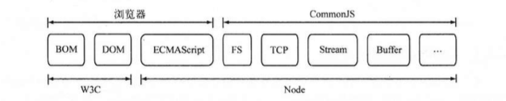

###模块化
随着ES6的渐渐普及，模块化也慢慢为人所知。历史上JavaScript是没有所谓的模块化的，后来社区慢慢的出现一些民间的模块化解决方案。随着Node.js出现伴随的是commonjs的模块化解决方案，同事EcmaScript2015也给出了自己的模块化解决方案。

ECMAScript规范出现的比较的早，但是规范的范畴非常的小，还是有如下缺陷：
- 没有模块系统。
- 标准库较少。
- 没有标准接口
- 缺乏包管理系统

Node与浏览器以及W3C组织、CommonJS组织、ECMAScript之间的关系，共同构成了一个繁荣的生态系统。

#### CommonJS的模块规范
CommonJS对模块的定义十分简单，主要分为模块引用、模块定义、模块标志3个部分。
1. 模块引用
模块引用示例代码如下
~~~~~js
var math = require('math')
~~~~~
2. 模块定义

   在模块中，上下文提供require（）方法来引用外部模块。对应引入的功能，上下文提供了exports对象用于到处当前模块的方法或者变量，并且它是唯一导出的出口。在Node中，一个文件代表的就是一个模块，在模块中存在一个module对象，它代表模块对象，exports是module的属性。

3. 模块标识

   模块标识其实就是传递给require()方法的参数，是以 .、..开头的相对路径，或者绝对路径。它可以没有文件名后缀js。 

#### Node的模块实现

在Node中模块引用模块，需要经历如下3个步骤：

1. 路径分析
2. 文件定位
3. 编译执行

在Node中，模块分为两类：一类是Node提供的模块，称为核心模块；另外是用户编写的模块，称为文件模块。

- 核心模块部分在Node源代码的编译，已经编译进二进制执行文件。在Node进程启动时，部分核心模块就直接加载进内存中，所以文件定位和编译执行直接省略，在路径分析中优先判断。
- 文件模块则是在运行时动态加载，需要完成的路径分析、文件定位、编译执行过程。

##### 优先从缓存加载

Node对于引用过的模块都会进行缓存，以减少二次引入时开销，而Node缓存的是编译和执行之后的对象。require()方法不同之处在于核心模块的缓存检查优先文件模块的缓存检查。

##### 路径分析和文件定位

1. 模块标识符分析

   - 核心模块，如http、fs、path等
   - .或.. 开始的相对路径文件模块
   - 以/开始的绝对路径文件模块

   模块路径是Node在定位文件模块的具体文件时指定的查找策略，具体表现为一个路径组成的数组，模块路径的生成规则如下：

   - 当前文件目录的node_modules目录
   - 父目录下的node_modules目录
   - 父目录的父目录下的node_modules目录
   - 沿路径向上递归，直到根目录下的node_modules目录

2. 文件定位

   require()在分析标识符的过程中，会出现标识符不包含文件扩展名的情况，Node会按照 .js、.node、 .json的次序补足扩展名。

##### 模块编译

在Node中，每个文件模块都是一个对象，它的定义如下：

~~~~~~js
function Module(id, parent){
    this.id = id;
    this.exports = {}
    this.parent = parent
    if(parent && parent.children){
        parent.children.push(this)
    }
    
    this.filename = null;
    this.loaded = false;
    this.children = []
}
~~~~~~

定位到一个具体的模块对象，然后根据路径载入并编译。对于不同的文件扩展名，其载入方法也有所不同，具体如下所示。

- .js文件。 通过fs模块同步读取文件编译执行
- .node文件。 这时c/c++编写的扩展文件，通过底层方法加载并编译生成的文件
- .json文件。 通过fs模块同步读取文件后，用JSON.parse()解析返回结果
- 其他类型。统一按照js的类型来载入

#####  exports 与module.exports之间的区别

Module.exports作为模块的一个内部属性，负责模块的对外到处的属性，exports其实是指向Module.exports的一个引用。

区别在于exports对象是通过形参的方式传入的，直接赋值形参会改变形参的引用，但是不能改变作用域的值。

