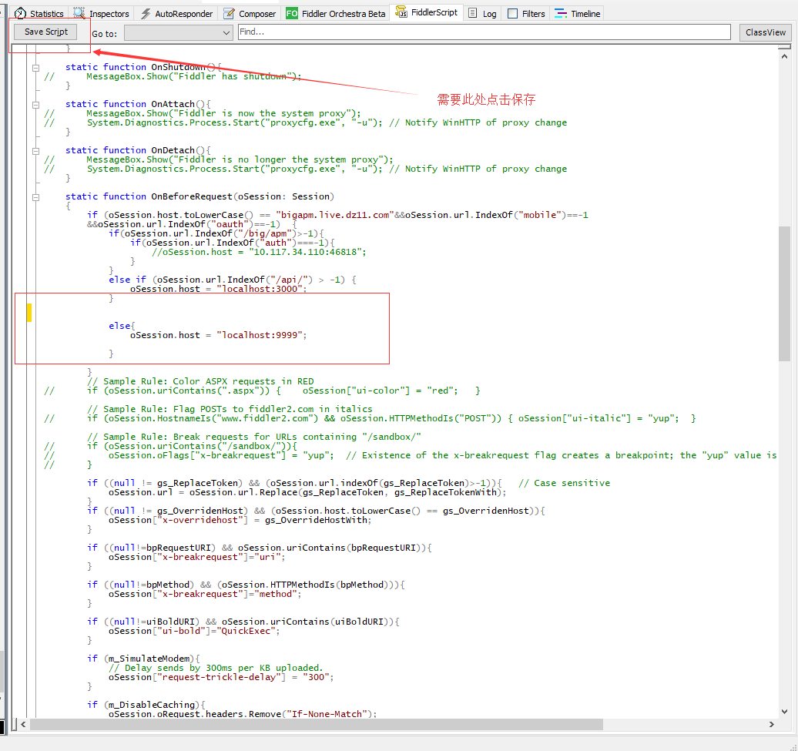

## FiddlerScript
FiddlerScript 是Fiddler 的一项非常强大的功能，它允许你增强Fiddler UI，添加新的特性，修改请求与响应内容等等。。。

## 编写FiddlerScript
FiddlerScript 基于JScript.NET 语言。在Fiddler 中点击菜单“Rules > Customize Rules”打开FiddlerScript Editor 编辑器，在这里可以编写Fiddler Script 脚本，只要一保存，Fiddler 将会重新编译脚本并自动加载，如果加载成功，则会播放声音并在Fiddler 状态栏显示"CustomRules.js was loaded at <datetime>" 提示信息，如果编译失败，将会显示错误提示信息。

如果你没有安装FiddlerScript Editor 插件，也可以在其他编辑器编写脚本，但是推荐使用FiddlerScript Editor编辑器，因为它具有语法高亮以及自动完成功能，下载地址http://fiddler2.com/fiddlerscript-editor。

## FiddlerScript中的主要方法
你的FiddlerScript 文件中包含一个静态类Handlers，一般来说，你的代码应该写在这个类的静态方法中。

### OnBeforeRequest
表示一个Session在发送之前的回调方法, 在这个方法中修改Request的内容

### OnBeforeResponse
表示一个Session在发送之前的回调方法， 在这个方法中修改Response的内容

## 一个实际案例
在实际的开发过程中出现过这种情况，服务器开发可能会落后与前端的开发, 需要直接连接到后端开发人员的电脑进行调试
我们需要使用Fiddler来反向代理连接到别人的开发人员的电脑。

~~~js
   
    static function OnBeforeRequest(oSession: Session)
	{
     // 判断是否需要进行反向代理 只有域名是bigapm.live.dz11.com 并且url中没有mobile 和 oauth 才进行代理
     if (oSession.host.toLowerCase() == "bigapm.live.dz11.com"&&oSession.url.IndexOf("mobile")==-1
        &&oSession.url.IndexOf("oauth")==-1)  {
            // 如果url中是　/big/apm 进行代理
            if(oSession.url.IndexOf("/big/apm")>-1){      
                if(oSession.url.IndexOf("auth")===-1){
                    // 此处host = "10.117.34.110:46818" 表示代理到的目的端口
                    //oSession.host = "10.117.34.110:46818";  
                }
            }
            else if (oSession.url.IndexOf("/api/") > -1) {
                 // 此处host = "10.117.34.110:46818" 表示代理到的目的端口
                oSession.host = "localhost:3000";
            }
            
            else{
                oSession.host = "localhost:9999";
            }          
        }
    }    
~~~

## 一个大坑
编写FiddlerScript后，默认使用ctrl + s 是没法保存的，FiddlerScript居然不支持国际通用的保存快捷键，我在这里掉了两次坑。

